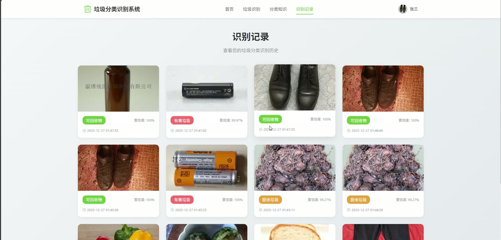
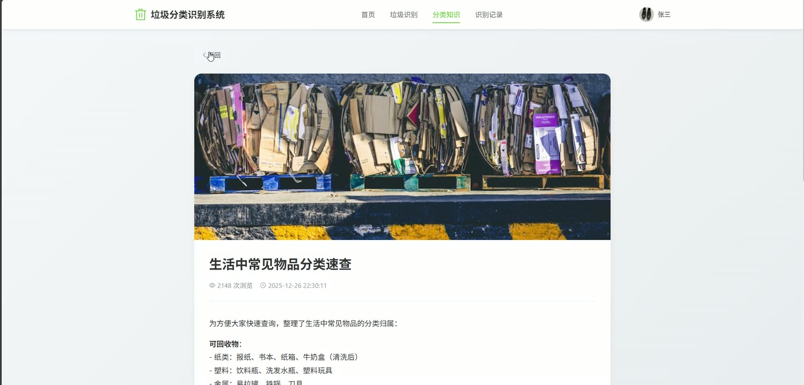
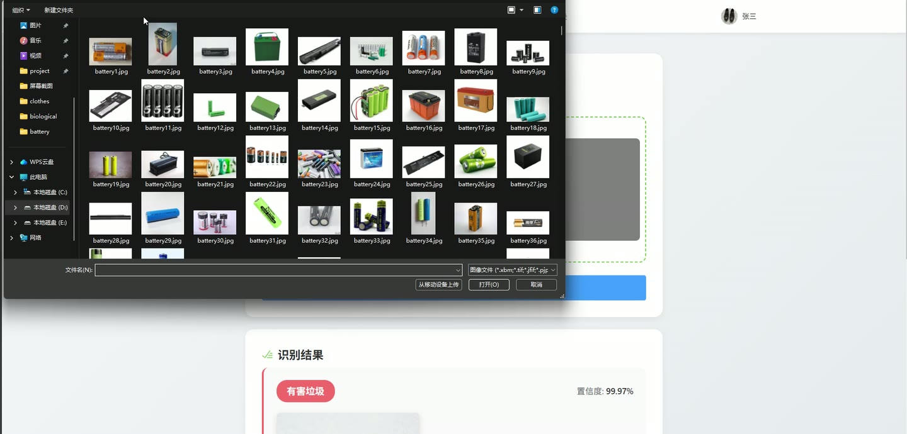
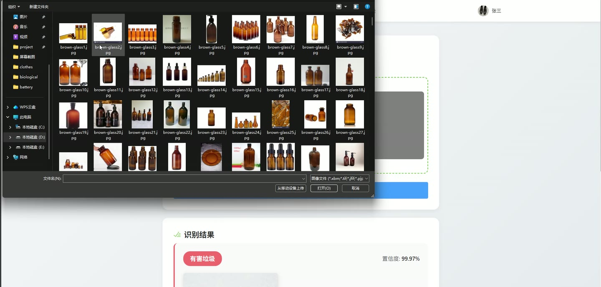
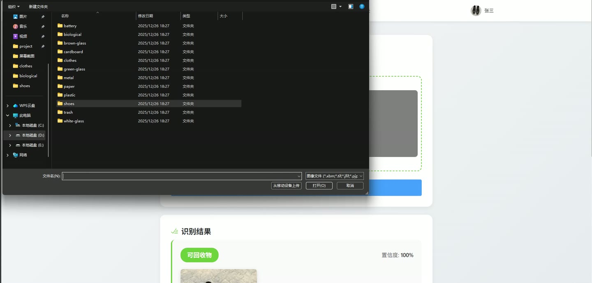
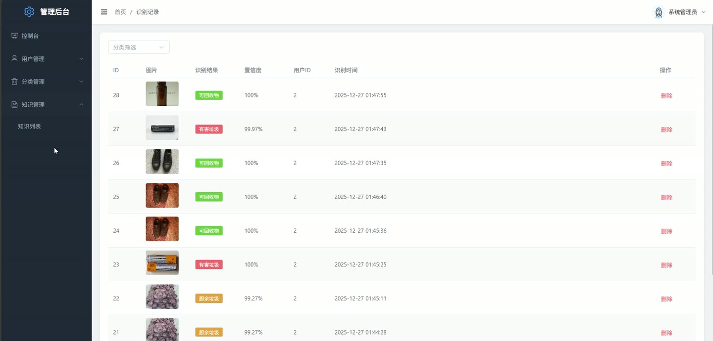

# (附文档)Python+深度学习+TensorFlow 垃圾分类识别系统

**技术栈**：Python、Django、TensorFlow、深度学习、Vue3、MySQL

### 系统简介

本系统是一套基于深度学习图像识别的垃圾分类识别平台，采用前后端分离架构。后端使用 Django REST Framework 提供接口，通过 TensorFlow 深度学习模型对上传的垃圾图片进行自动分类识别；前端使用 Vue3 构建用户端与管理端两套界面。系统包含普通用户端与管理员端两类角色，覆盖图片识别、识别记录、分类知识库、用户管理等完整业务闭环。
 
### 核心功能
 
### 普通用户端

 
- 用户注册：填写用户名、密码、昵称、邮箱、手机号完成注册，注册后自动返回登录令牌。 
- 用户登录：输入用户名与密码登录，校验账号状态，禁用账号无法登录。 
- 个人中心：查看并修改昵称、头像、邮箱、手机号，支持留空不修改密码方式更新密码。 
- 图片上传识别：上传垃圾图片或提供图片 URL，调用深度学习模型返回识别结果。 
- 识别结果展示：显示识别出的分类名称、置信度以及全部候选分类的概率分布。 
- 识别记录查询：分页查看本人历史识别记录，按时间倒序展示图片、分类与置信度。 
- 分类知识浏览：分页浏览已发布的垃圾分类知识文章，支持按分类与标题关键词筛选。 
- 知识详情查看：查看知识文章标题、内容、配图，浏览时自动累加浏览次数。 
- 分类类别查看：获取全部垃圾分类类别信息，包含名称、图标、颜色、投放提示与常见物品示例。 
- 首页与导航：提供首页、垃圾识别、分类知识、识别记录、个人中心等页面入口，受保护页面需登录访问。
 
### 管理员端

 
- 管理员登录：使用管理员账号登录后台，非 admin 角色账号拒绝登录。 
- 控制台统计：展示用户总数、识别总次数、分类类别数、知识文章数，并显示今日新增用户与今日识别次数。 
- 趋势图表：以折线图展示近 7 天识别次数趋势。 
- 分类占比图表：以饼图展示各垃圾类别的识别数量占比。 
- 用户管理：分页查看用户列表，支持按用户名关键词与角色筛选。 
- 用户新增与编辑：新增用户可设置用户名、密码、昵称、邮箱、手机号、角色、状态、头像；编辑时密码留空表示不修改。 
- 用户删除：删除指定用户，且不允许删除当前登录的管理员自身账号。 
- 分类类别管理：分页查看分类列表，支持新增、编辑、删除分类。 
- 分类字段维护：维护类别名称、描述、图标、颜色、投放提示、常见物品示例，名称重复时校验拦截。 
- 识别记录管理：分页查看全部识别记录，支持按分类筛选，展示图片、识别结果、置信度、用户 ID 与识别时间。 
- 识别记录删除：删除指定识别记录。 
- 知识文章管理：分页查看知识列表，支持按标题关键词与分类筛选。 
- 知识新增与编辑：维护标题、内容、所属分类、配图、显示状态，标题与内容为必填项。 
- 知识删除：删除指定知识文章。 
- 个人信息维护：查看并修改管理员昵称、头像、邮箱、手机号与密码。
 
### 技术栈

 后端框架Django + Django REST Framework 深度学习TensorFlow 图像分类模型 数据库MySQL（通过 PyMySQL 驱动接入） 鉴权方式Token 令牌校验（Bearer 头传递，区分 admin 与 user 角色） 密码加密SHA-256 哈希存储 前端框架Vue3 + Vue Router UI 组件库Element Plus 图表库ECharts 构建工具Vite 文件存储本地 MEDIA 目录按日期分目录存储上传图片
 
### 交付内容

 
- 后端完整源码 
- 前端完整源码 
- 数据库初始化脚本 
- 万字文档

## 界面展示

---

## 获取完整源码 + 万字文档

本仓库为项目介绍页。**完整前后端源码、数据库初始化脚本、万字项目文档**，请加微信 `kangkangcode`，或访问 [codekk.top](http://codekk.top) 获取。

可作课程设计 / 毕业设计参考，支持远程部署调试。